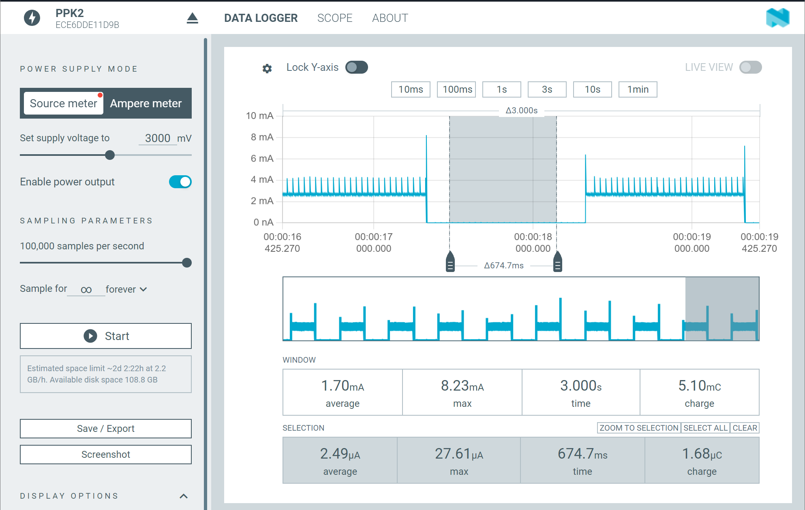

# Simple Example of FreeRTOS porting on a Custom nRF52 Board

By default, the nRF52 chip is not supported by FreeRTOS. However, since it uses an ARM Cortex-M4, we can manually port FreeRTOS to it.

This repository provides basic examples of porting FreeRTOS to the nRF52 using PlatformIO with the Arduino framework. The FreeRTOS kernel files are located in `lib/FreeRTOS/`, so we need to add the following build flags and sources to `platformio.ini`:

```ini
build_flags =
  -I lib/FreeRTOS/include
  -I lib/FreeRTOS/portable/GCC/ARM_CM4F
build_src_filter  =
  +<*>
  +<lib/FreeRTOS/*.c>
  +<lib/FreeRTOS/portable/GCC/ARM_CM4F/*.c>
  +<lib/FreeRTOS/portable/MemMang/*.c>
```
The FreeRTOS kernel used in this example is version 11.0.0.

## Examples

- ### Simple FreeRTOS for LED Blinking with Two LEDs
  This example modifies `FreeRTOSConfig.h` to add the following handlers, which connect the MCU to FreeRTOS:
  
    - `#define vPortSVCHandler SVC_Handler`
    - `#define xPortPendSVHandler PendSV_Handler`
    - `#define xPortSysTickHandler SysTick_Handler`
  
  The SysTick timer uses the CPU's main clock.

- ### Simple FreeRTOS with Low-Power Mode and LED Blinking
  In this example, `FreeRTOSConfig.h` is modified to add:

    - `#define vPortSVCHandler SVC_Handler`
    - `#define xPortPendSVHandler PendSV_Handler`

  The SysTick timer uses the RTC's clock, set with `#define configSYSTICK_CLOCK_HZ (32768UL)`. Additionally, the default SysTick behavior of the RTOS is overridden in `low_power_config.cpp`.

      
    **Figure:** Power consumption measurement shows ~2.5 µA at 3V when the LED is off.


**Note: In this example, I am using a custom board based on nRF52832. Also, for the programmer, CMSIS-DAP programmer hardware is used (with 4 connections: VCC, GND, DIO, CLK). Adjust its upload_protocol and debug_tool according to your needs.*